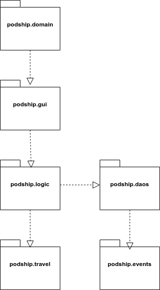
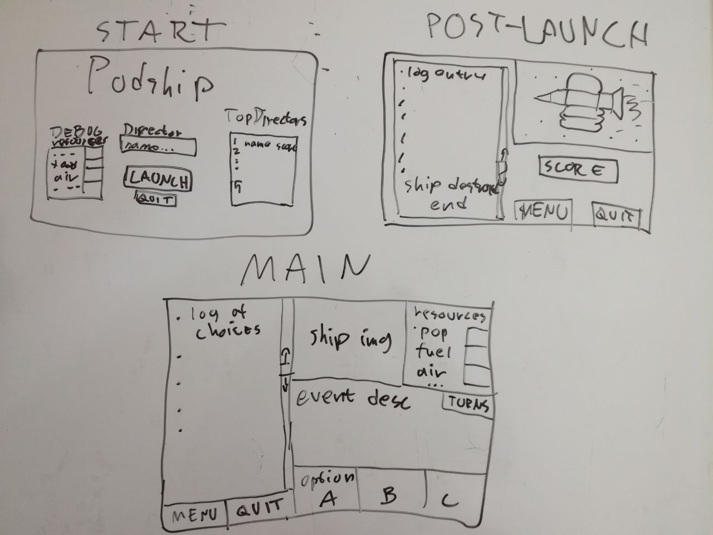
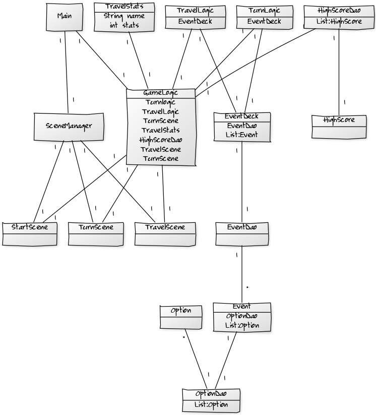

# Program Architecture
(Updated 2nd May 2018)

## Packaging

The domain package initiates the game, with the gui package containing the interface elements, and the logic package containing the execution of the game. Persisting event package information is fetched through the daos package, and the travel package contains the information for the current game.

## UI
Currently text UI only. GUI will include three screens:
- Start screen
- Construction phase
- Travel phase

_Mockups for the GUI screens._

Each screen will be its own Scene object, and only one will be visible at a time on the program's Stage. GUI will be in the podship.gui package.

## Application logic

_Initial class diagram._

## Database & Permanent data
Currently the events are coded into the mock DAOs. Hopefully they'll find their way to a Google Sheet later on. At that point, DAO will access the needed Event and Object data from the GSheet as needed. There's no need to write to the GSheet, unless the highscore list will be implemented.

## Main functionalities

### Initialisation

### Event creation
Will be done via Daos from the to be created database (pref. Google Sheets.)

### Construction Turn
Each Construction turn presents the player with one event description. Player will then make a choice out of three possibilities. These choices unlock events for the Travel phase, and affect statistics.

### Travel Turn
During each Travel turn, a random event is drawn. If the ship has enough resources to encounter it, it is described to the player, and its effects are resolved.
If the ship does not have enough resources for the encounter, a basic travel event is encountered instead.

## Extras

_Class diagram concept image._
