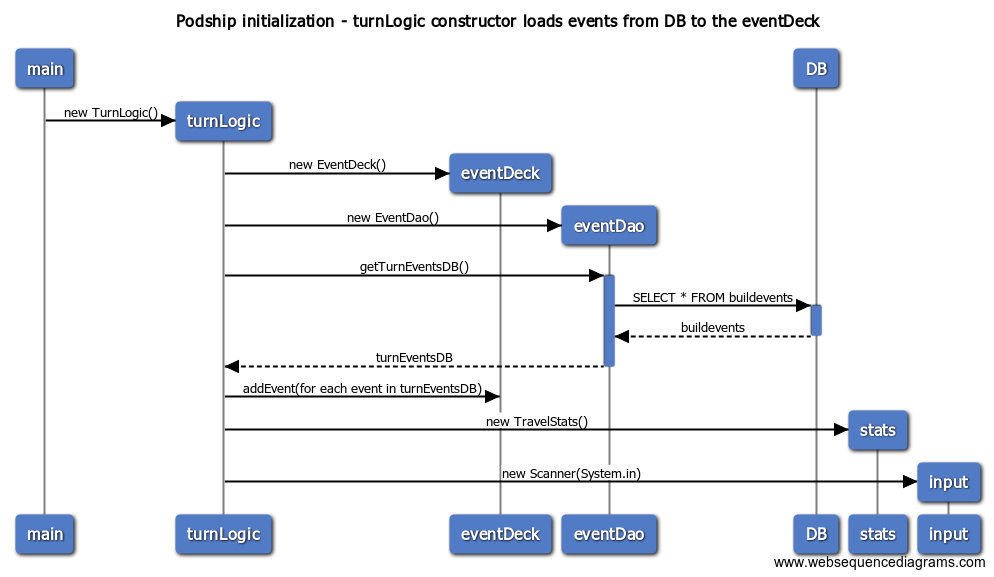

# Program Architecture

## Packaging

The domain package initiates the game, with the gui package containing the interface elements, and the logic package containing the execution of the game. Persisting event package information is (to be) fetched through the daos package, and the travel package contains the information for the current game.

## UI
GUI includes three screens:
- Start screen
- Construction phase
- Travel phase

_Mockups for the GUI screens._

Each screen will be its own Scene-like object, and only one will be visible at a time on the program's Stage, managed by the SceneManager. All of GUI files are in the podship.gui package.

Logic and GUI relay information as needed from logic to gui to update the scene, and vice versa to transfer player input to logic classes.

## Application logic

_Class diagram._

Main game runner is the GameLogic class, that connects to the different scenes and the corresponding logics, and runs the timing of the game. Each scene and logic talks to the GameLogic class. Process begins from the Main class that initiates the GameLogic and SceneManager, rest is done in GameLogic and appropriate scenes.

## Database & Permanent data
Currently the events are coded into the mock DAOs. Hopefully they'll find their way to a Google Sheet later on. At that point, DAO will access the needed Event and Object data from the GSheet as needed. There's no need or possibility to write to the Google Sheet as it will be accessed via API key instead of authentication. Potentially a local, permanent highscore list will be implemented as a local database later on.

## Main functionalities

### Initialisation

### Event creation
Will later on be done via Daos from the to be created database (pref. Google Sheets.) Currently the few prewritten events are created in the event classes, as well as the debug/placeholder events that fill most of the current gameplay.

### Construction Turn
Each Construction turn presents the player with one event description. Player will then make a choice out of three possibilities. These choices unlock events for the Travel phase, and affect statistics.

### Travel Turn
During each Travel turn, a random event is drawn. If the ship has enough resources to encounter it, it is described to the player, and its effects are resolved.
If the ship does not have enough resources for the encounter, a basic travel event is encountered instead.

## Extras

_Class diagram concept image. Funny how things change, eh..._
